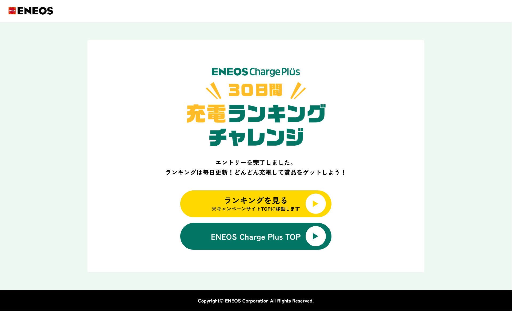
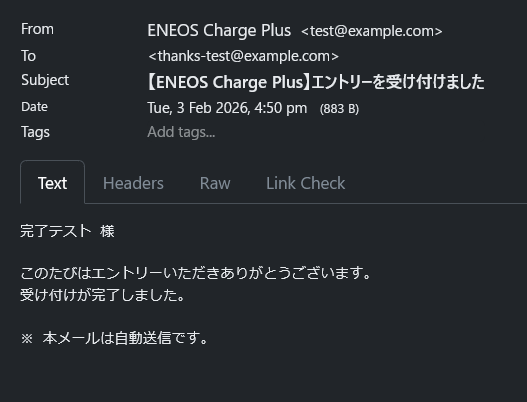
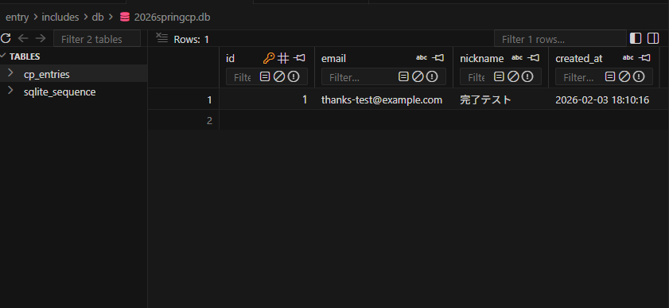
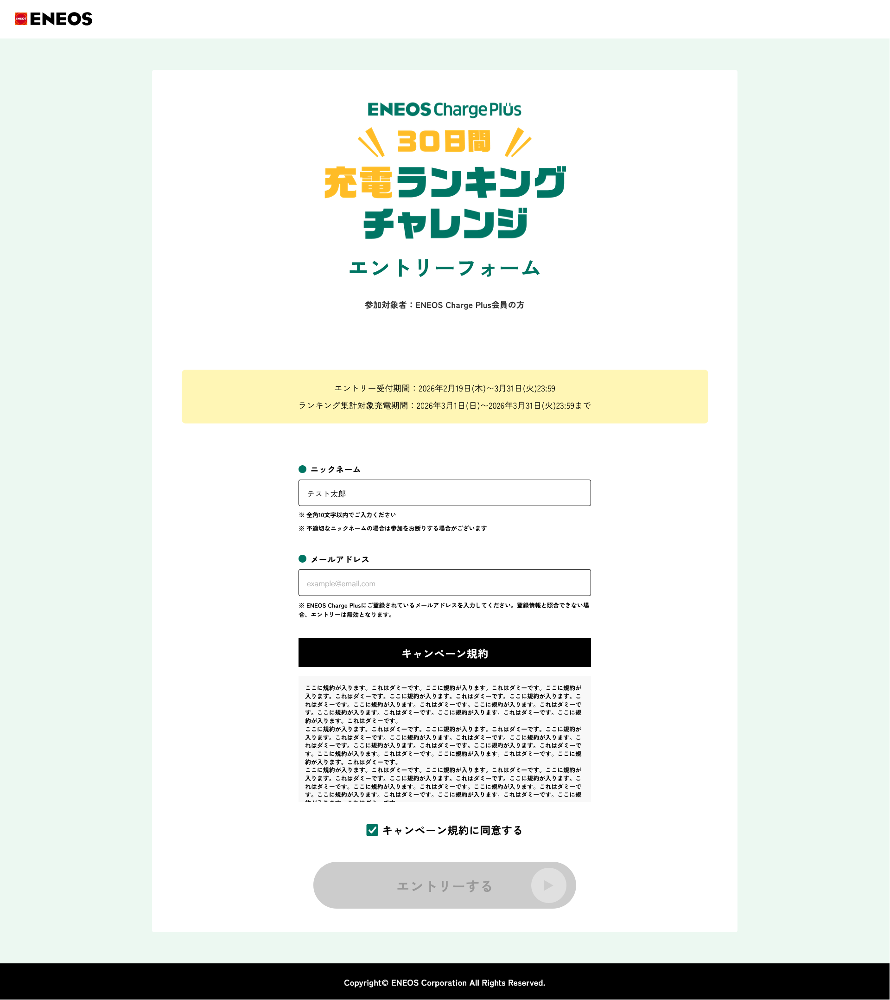
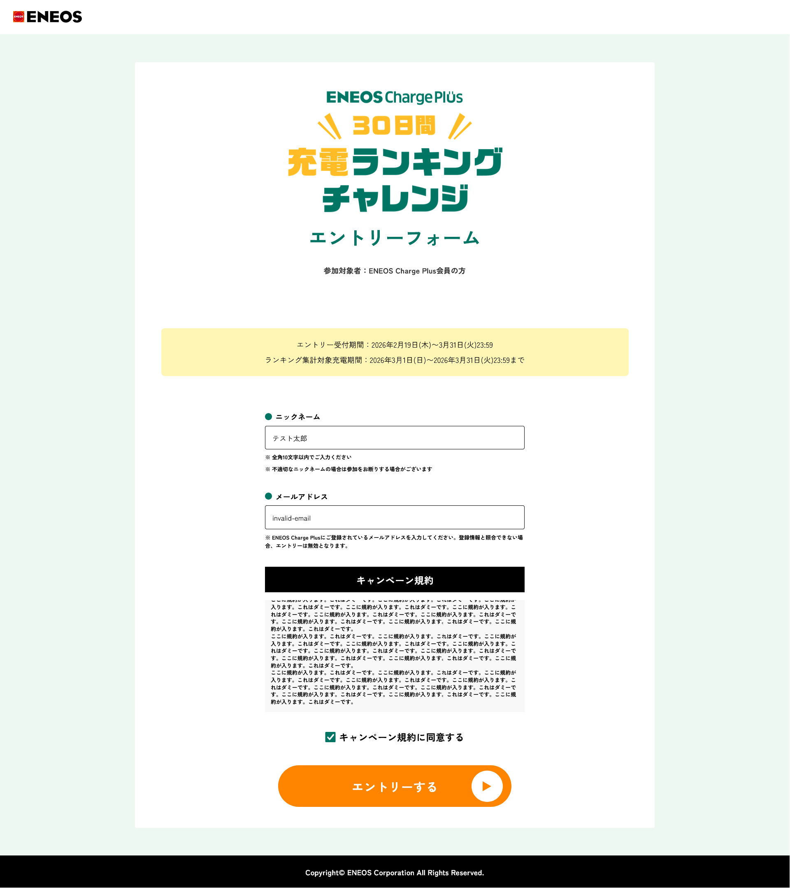
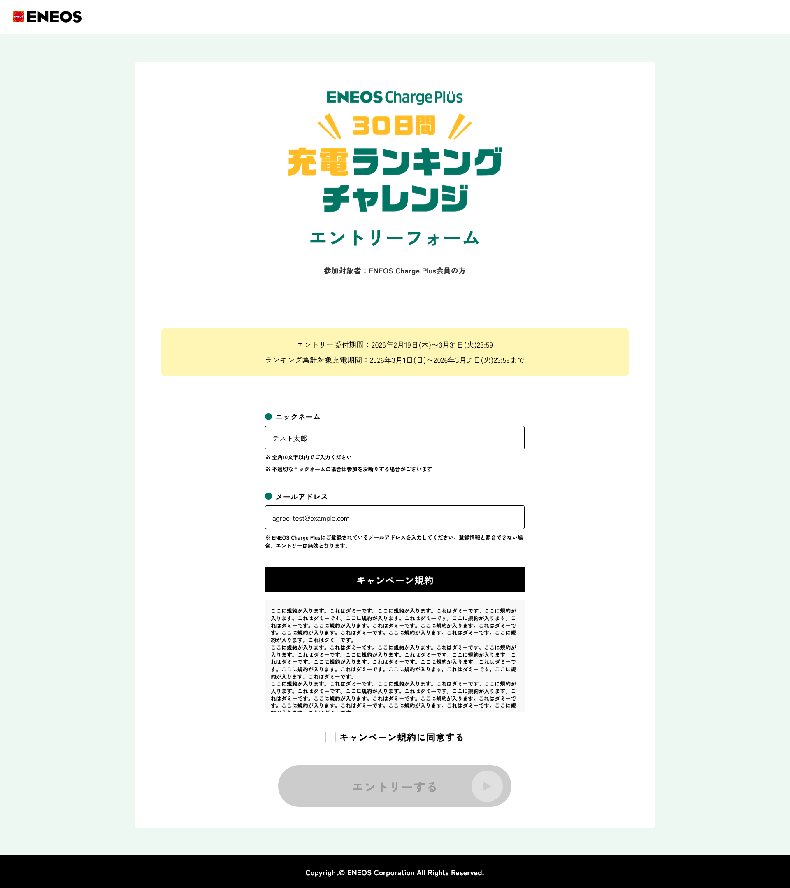
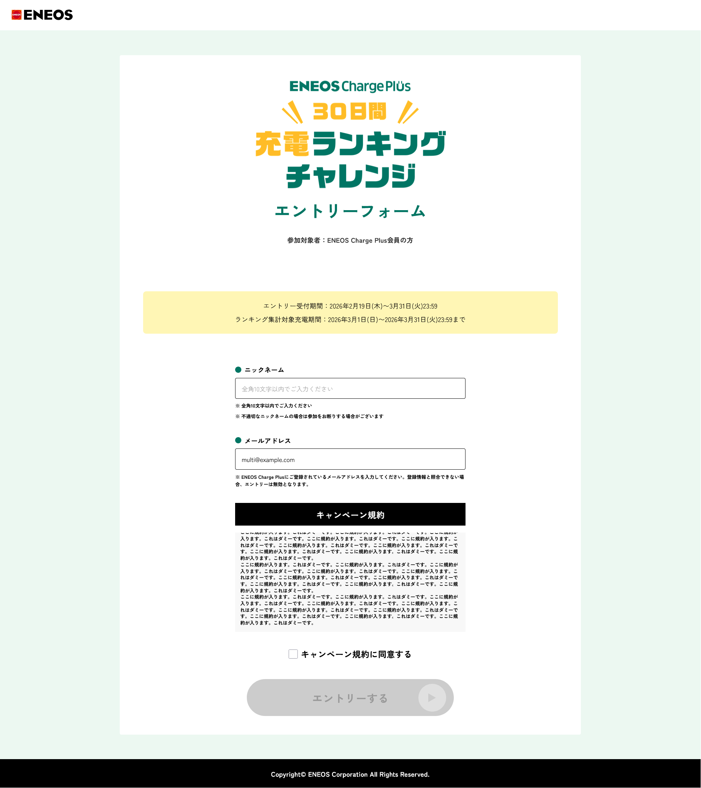
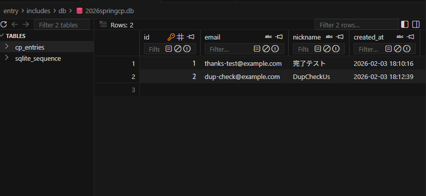
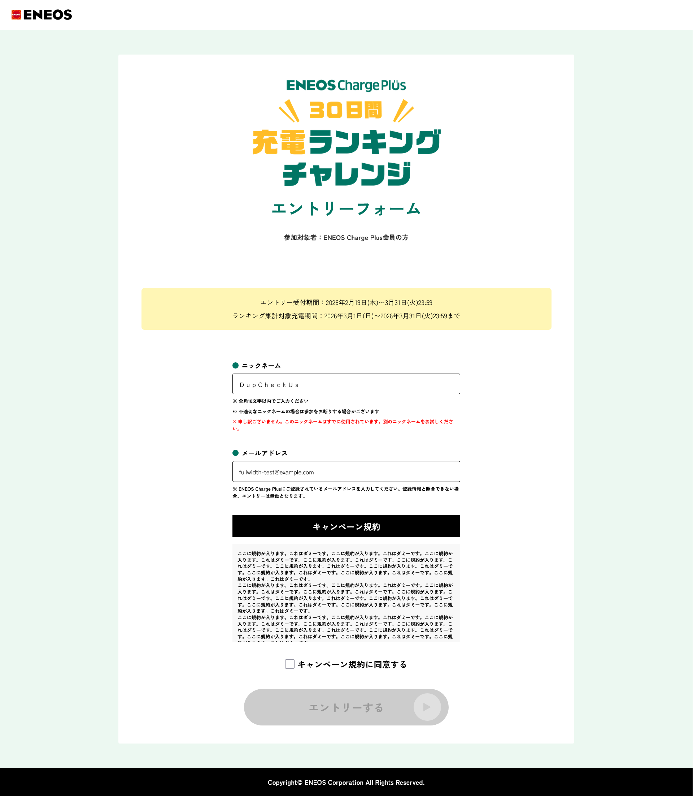
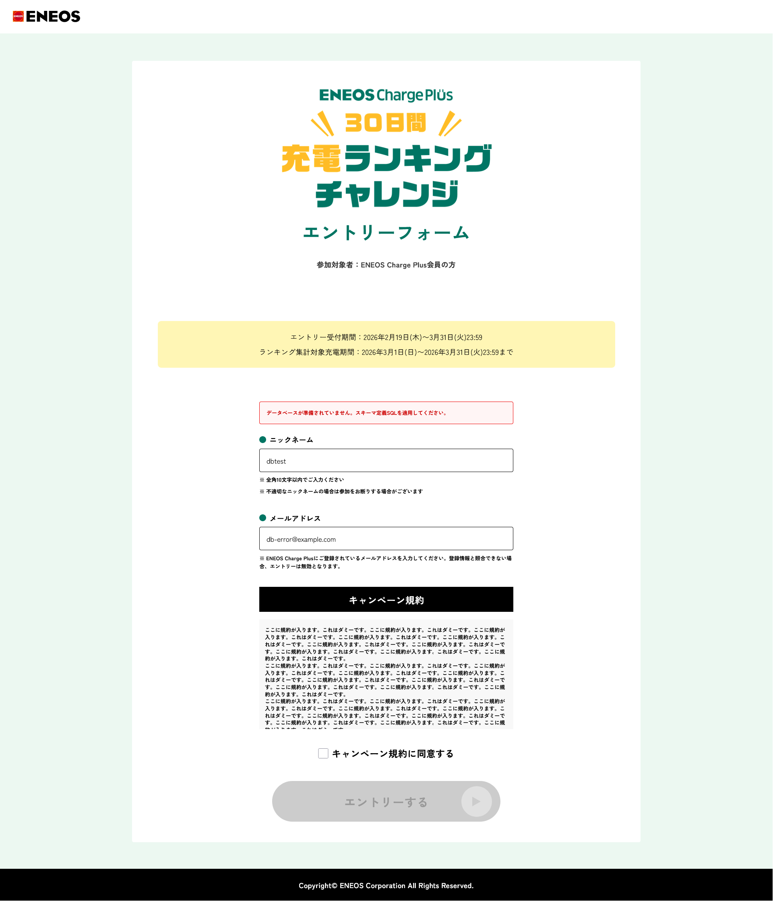

# エントリーフォーム 結合テスト

**関連資料**:
- [プロジェクト概要](../01_概要/プロジェクト概要.md)
- [基本設計](../03_設計/基本設計.md)
- [データベース設計](../03_設計/データベース設計.md)

**Release**: （実施時に記入）

**対象**: エントリーフォーム（entry/index.php | entry/includes/send.php | thanks.html）

**テスト分類**: 結合テスト

**作成日**: 2026年2月3日

---

## テスト目的

エントリーフォームについて、次の観点で確認する。

| 観点 | 確認内容 |
| --- | --- |
| 正常フロー | フォーム表示（GET）、入力チェック、重複チェック、登録・自動返信メール・完了画面への遷移が要件どおり動作すること。 |
| エラー表示 | エラー時に入力値が復元され、エラー文言が適切に表示されること（上部まとめは nickname・email 以外、入力欄直下は nickname・email）。 |
| セキュリティ | CSRF 検証が有効であること。 |

---

## テスト実施方法

テストケースに沿ってブラウザ上の画面を操作する手動テストとして実施する。

異常系（CSRF 不正等）は、開発者ツールで POST データを改変するなどして実施する。

### テスト結果の報告

各 No. の「結果」欄に次のいずれかを記載する。

- **OK**: 期待結果どおりであった
- **NG**: 別途、**NG報告**へ詳細を記述
- **未実施**: 実施しなかった（理由を備考に記載）

### テスト実施ログ

- テスト実施時に取得した画面キャプチャ、ダウンロードした帳票等を添付する

### NG報告の記入例

- **確認番号**: 項番＋No（例: `2.1-1`、`3.2.4-1`）
- **課題番号**: バックログ等の課題へのリンク（例: `#12`、Jira の KEY、課題 URL）
- **ＮＧ内容**: どのような NG が発生したか（現象の概要）
- **状況・再現手順**: どのような操作・条件で発生したか（再現手順）
- **添付ファイル**: 添付がある場合はファイル名やリンクを記入。なしの場合は空欄
- **対応状況**: 対応完了時は「済」、未対応の場合は空欄または「未」など

---

## 1. 初期表示

**操作手順**

1. エントリーフォームの URL に GET でアクセスする

| No. | 実施 | 結果 | 確認内容 | 備考 |
| --- | --- | --- | --- | --- |
| 1 | [x] | OK | フォームが表示され、タイトル・キャンペーン名が表示されること |  |
| 2 | [x] | OK | ニックネーム入力欄（maxlength=10）、メールアドレス入力欄、規約同意チェック、送信ボタンが表示されること | OK |
| 3 | [x] | OK | エラー表示エリアが空（または非表示）であること |  |
| 4 | [x] | OK | 「エントリーする」ボタンがグレーアウトされ、ボタンを押せないこと |  |
| 5 | [x] | OK | hidden で mode=send および token が含まれること（開発者ツールで確認可） |  |

---

## 2. 正常系（登録・メール・完了画面）

### 2.1. キャンペーン参加登録

**操作手順**

1. 1. 初期表示と同様に、エントリーフォーム（entry/index.php）を表示する
2. 下記テストデータを入力し、送信する

#### テストデータ

| 項目 | 入力値 |
| --- | --- |
| ニックネーム | `完了テスト`（未使用） |
| メールアドレス | `thanks-test@example.com`（未使用。Mailpit 等で受信確認できるアドレス推奨） |
| 規約同意 | チェックする |

| No. | 実施 | 結果 | 確認内容 | 備考 |
| --- | --- | --- | --- | --- |
| 1 | [x] | OK | thanks.html にリダイレクトされ、完了画面が表示されること |  |
| 2 | [x] | OK | 申込み者宛に自動返信メール（件名: 【ENEOS Charge Plus】エントリーを受け付けました）が届くこと | Mailpit 等で確認 |
| 3 | [x] | OK | メール本文にニックネーム「完了テスト」が含まれること |  |
| 4 | [x] | OK | entries に 1 件追加されていること（DBクライアントで確認） |  |

---

## 3. 異常系

### 3.1. 入力チェック

#### 3.1.1. ニックネーム未入力

**操作手順**

1. 1. 初期表示と同様に、エントリーフォーム（entry/index.php）を表示する
2. 下記テストデータを入力し、送信する

#### テストデータ

| 項目 | 入力値 |
| --- | --- |
| ニックネーム | （空欄） |
| メールアドレス | `valid@example.com` |
| 規約同意 | チェックする |

| No. | 実施 | 結果 | 確認内容 | 備考 |
| --- | --- | --- | --- | --- |
| 1 | [x] | OK | フォームに戻り、ニックネーム入力欄直下に「ニックネームを入力してください。」が表示されること |  |
| 2 | [x] | OK | メールアドレス欄に `valid@example.com` が復元されていること |  |

#### 3.1.2. メールアドレス未入力

**操作手順**

1. 1. 初期表示と同様に、エントリーフォーム（entry/index.php）を表示する
2. 下記テストデータを入力し、送信する

#### テストデータ

| 項目 | 入力値 |
| --- | --- |
| ニックネーム | `テスト太郎` |
| メールアドレス | （空欄） |
| 規約同意 | チェックする |

| No. | 実施 | 結果 | 確認内容 | 備考 |
| --- | --- | --- | --- | --- |
| 1 | [x] | OK | フォームに戻り、メールアドレス入力欄直下に「メールアドレスを入力してください。」が表示されること |  |
| 2 | [x] | OK | ニックネーム欄に「テスト太郎」が復元されていること |  |

#### 3.1.3. メールアドレス形式不正

**操作手順**

1. 1. 初期表示と同様に、エントリーフォーム（entry/index.php）を表示する
2. 下記テストデータを入力し、送信する

#### テストデータ

| 項目 | 入力値 |
| --- | --- |
| ニックネーム | `テスト太郎` |
| メールアドレス | `invalid-email` |
| 規約同意 | チェックする |

| No. | 実施 | 結果 | 確認内容 | 備考 |
| --- | --- | --- | --- | --- |
| 1 | [x] | OK | フォームに戻り、メールアドレス入力欄直下に「メールアドレスの入力形式が正しくありません。」が表示されること |  |

#### 3.1.4. 規約未同意

**操作手順**

1. 1. 初期表示と同様に、エントリーフォーム（entry/index.php）を表示する
2. 下記テストデータを入力し、送信する

#### テストデータ

| 項目 | 入力値 |
| --- | --- |
| ニックネーム | `テスト太郎` |
| メールアドレス | `agree-test@example.com` |
| 規約同意 | チェックしない |

| No. | 実施 | 結果 | 確認内容 | 備考 |
| --- | --- | --- | --- | --- |
| 1 | [x] | OK | フォームに戻り、上部のエラーまとめに「キャンペーン規約に同意してください。」が表示されること |  |
| 2 | [x] | OK | ニックネーム・メールアドレス欄に入力値が復元されていること |  |

#### 3.1.5. 複数エラー（ニックネーム未入力＋規約未同意）

**操作手順**

1. 1. 初期表示と同様に、エントリーフォーム（entry/index.php）を表示する
2. 下記テストデータを入力し、送信する

#### テストデータ

| 項目 | 入力値 |
| --- | --- |
| ニックネーム | （空欄） |
| メールアドレス | `multi@example.com` |
| 規約同意 | チェックしない |

| No. | 実施 | 結果 | 確認内容 | 備考 |
| --- | --- | --- | --- | --- |
| 1 | [x] | OK | ニックネーム入力欄直下に「ニックネームを入力してください。」が表示されること |  |
| 2 | [x] | OK | 上部のまとめに「キャンペーン規約に同意してください。」が表示されること |  |
| 3 | [x] | OK | メールアドレス欄に `multi@example.com` が復元されていること |  |

---

### 3.2. 重複チェック

**前提条件**

- 事前準備で定義した「重複チェック用の既存 1 件」が entries に登録されていること（3.2.1〜3.2.4 のテストデータはこの既存レコードと正規化して一致するものを使用する）。

**事前準備**

1. 1. 初期表示と同様に、エントリーフォーム（entry/index.php）を表示する
2. 下記「重複チェック用の既存 1 件」のテストデータを入力し、送信する
3. thanks.html に遷移し、完了画面が表示されることを確認する（登録成功）
4. DBクライアントで entries に 1 件以上あることを確認する

※ すでに entries に 1 件以上ある場合でも、ニックネーム `DupCheckUser`・メールアドレス `dup-check@example.com` の組み合わせのレコードが存在することを確認する。存在しない場合は上記 1〜3 を実施してから 3.2.1〜3.2.4 を行う。

#### テストデータ（重複チェック用の既存 1 件）

| 項目 | 入力値 |
| --- | --- |
| ニックネーム | `DupCheckUser` |
| メールアドレス | `dup-check@example.com` |
| 規約同意 | チェックする |

#### 3.2.1. ニックネーム重複（完全一致）

**操作手順**

1. 1. 初期表示と同様に、エントリーフォーム（entry/index.php）を表示する
2. 下記テストデータを入力し、送信する

#### テストデータ

| 項目 | 入力値 |
| --- | --- |
| ニックネーム | `DupCheckUser`（事前準備で登録した既存ニックネーム） |
| メールアドレス | `new-mail@example.com`（未登録） |
| 規約同意 | チェックする |

| No. | 実施 | 結果 | 確認内容 | 備考 |
| --- | --- | --- | --- | --- |
| 1 | [x] | OK | フォームに戻り、ニックネーム入力欄直下に「申し訳ございません。このニックネームはすでに使用されています。別のニックネームをお試しください。」が表示されること |  |

#### 3.2.2. ニックネーム重複（大文字小文字の違い）

**操作手順**

1. 1. 初期表示と同様に、エントリーフォーム（entry/index.php）を表示する
2. 下記テストデータを入力し、送信する

#### テストデータ

| 項目 | 入力値 |
| --- | --- |
| ニックネーム | `dupcheckuser`（事前準備の既存 `DupCheckUser` の小文字。正規化で一致するため重複となる） |
| メールアドレス | `case-test@example.com`（未登録） |
| 規約同意 | チェックする |

| No. | 実施 | 結果 | 確認内容 | 備考 |
| --- | --- | --- | --- | --- |
| 1 | [x] | OK | ニックネーム重複のエラーが表示されること（大文字小文字を無視した重複判定であること） |  |

#### 3.2.3. ニックネーム重複（全角入力）

**操作手順**

1. 1. 初期表示と同様に、エントリーフォーム（entry/index.php）を表示する
2. 下記テストデータを入力し、送信する

#### テストデータ

| 項目 | 入力値 |
| --- | --- |
| ニックネーム | `ＤｕｐＣｈｅｃｋＵｓｅｒ`（事前準備の既存 `DupCheckUser` の全角英字。正規化で一致するため重複となる） |
| メールアドレス | `fullwidth-test@example.com`（未登録） |
| 規約同意 | チェックする |

| No. | 実施 | 結果 | 確認内容 | 備考 |
| --- | --- | --- | --- | --- |
| 1 | [x] | OK | ニックネーム重複のエラーが表示されること（全角・半角を正規化して同一とみなす重複判定であること） |  |

#### 3.2.4. メールアドレス重複

**操作手順**

1. 1. 初期表示と同様に、エントリーフォーム（entry/index.php）を表示する
2. 下記テストデータを入力し、送信する

#### テストデータ

| 項目 | 入力値 |
| --- | --- |
| ニックネーム | `UniqueNick`（未登録） |
| メールアドレス | `dup-check@example.com`（事前準備で登録した既存メールアドレス） |
| 規約同意 | チェックする |

| No. | 実施 | 結果 | 確認内容 | 備考 |
| --- | --- | --- | --- | --- |
| 1 | [x] | OK | フォームに戻り、メールアドレス入力欄直下に「既にエントリー済みのメールアドレスです。」が表示されること |  |

---

### 3.3. CSRF トークン不正

**操作手順**

1. 1. 初期表示と同様に、エントリーフォーム（entry/index.php）を表示する
2. 下記テストデータのとおり（正常なニックネーム・メール・規約同意を）入力する
3. 送信ボタンを押す直前に、開発者ツールで `token` の hidden 値を別の文字列に変更する
4. 送信する

#### テストデータ

| 項目 | 入力値 |
| --- | --- |
| フォーム入力 | 正常なニックネーム・メール・規約同意 |
| token | 開発者ツールで別の文字列に改ざん |

| No. | 実施 | 結果 | 確認内容 | 備考 |
| --- | --- | --- | --- | --- |
| 1 | [x] | OK | 「不正なアクセスです。」が表示されること |  |
| 2 | [x] | OK | 登録が行われず、thanks.html に遷移しないこと |  |

### 3.4. DB 未準備

**前提条件**: entries が存在しない状態にする

**事前準備**

1. .db を削除（または未適用の .db に差し替え）

**操作手順**

1. 前提条件を満たした環境で、1. 初期表示と同様にエントリーフォーム（entry/index.php）を表示する
2. 下記テストデータを入力し、送信する

#### テストデータ

| 項目 | 入力値 |
| --- | --- |
| ニックネーム | `dbtest` |
| メールアドレス | `db-error@example.com` |
| 規約同意 | チェックする |

| No. | 実施 | 結果 | 確認内容 | 備考 |
| --- | --- | --- | --- | --- |
| 1 | [x] | OK | フォームに戻り、上部のエラーまとめに「データベースが準備されていません。スキーマ定義SQLを適用してください」が表示されること |  |

### 3.5. メール送信エラー

**前提条件**: メール送信が失敗する状態にする

**事前準備**

1. Mailpit コンテナを停止

```bash
# テスト前に Mailpit を停止
docker compose stop mailpit

# 上記操作手順でフォーム送信を実施し、期待結果を確認

# テスト後に Mailpit を再開（通常運用に戻す）
docker compose start mailpit
```

**操作手順**

1. 前提条件を満たした環境で、1. 初期表示と同様にエントリーフォーム（entry/index.php）を表示する
2. 下記テストデータを入力し、送信する

#### テストデータ

| 項目 | 入力値 |
| --- | --- |
| ニックネーム | `mailerrortest` |
| メールアドレス | `mail-error@example.com` |
| 規約同意 | チェックする |

| No. | 実施 | 結果 | 確認内容 | 備考 |
| --- | ---- | ---- | -------- | ---- |
| 1 | [x] | OK | 「申し訳ございません。送信処理中にエラーが発生しました。」が表示されること |  |
| 2 | [x] | OK | thanks.html に遷移しないこと |  |
| 3 | [x] | OK | entries に本件が登録されていないこと（メール送信失敗時はロールバックするため） | DB クライアントで確認 |

---

## テスト実施結果

### 1回目

- **実施日時**： 2026年2月3日
- **担当者**： 松尾
- **対象バージョン**： develop
- **実施環境**： Windows11 Chrome

#### NG報告

| 確認番号 | 課題番号 | ＮＧ内容 | 状況・再現手順 | 添付ファイル | 対応状況 | 備考 |
| --- | --- | --- | --- | --- | --- | --- |
|  |  |  |  |  |  |  |
|  |  |  |  |  |  |  |

#### テスト実施ログ

1. 初期表示


2. 正常系

- 2.1. キャンペーン参加登録

  - No.1 完了画面


  - No.2 メール


  - No.4 DB


3. 異常系

- 3.1. 入力チェック

  ※ 未入力系のチェックは、クライアント側のチェックで、入力されるまで「エントリーする」ボタンは非活性のまま

  - 3.1.1. ニックネーム未入力


  - 3.1.2. メールアドレス未入力


  - 3.1.3. メールアドレス形式不正


  ※ 形式不正は、クライアント側のチェックで、アラートが表示される

  - 3.1.4. 規約未同意


  - 3.1.5. 複数エラー



- 3.2. 重複チェック

  - 事前準備


  - 3.2.1 ニックネーム重複（完全一致）


  - 3.2.2 ニックネーム重複（大文字小文字の違い）


  - 3.2.3 ニックネーム重複（全角入力）


  - 3.2.4. メールアドレス重複


- 3.3. CSRF トークン不正


- 3.4. DB 未準備


- 3.5. メール送信エラー


  - No.3 DB登録はロールバックされる

